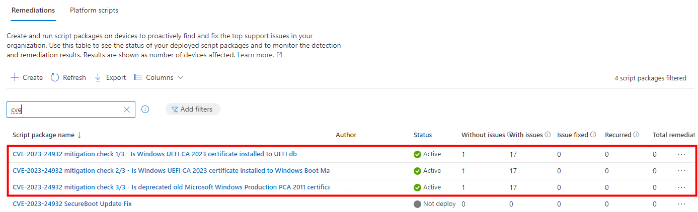

# CVE-2023-24932 - UEFI Secure Boot BlackLotus mitigations and reporting #

### Read Microsoft mitigation instructions ###
[KB5025885: How to manage the Windows Boot Manager revocations for Secure Boot changes associated with CVE-2023-24932](https://support.microsoft.com/en-au/topic/kb5025885-how-to-manage-the-windows-boot-manager-revocations-for-secure-boot-changes-associated-with-cve-2023-24932-41a975df-beb2-40c1-99a3-b3ff139f832d)

### Does this affect me? ###
**Yes**

### Short summary what is happening ###
* BlackLotus Bootkit bypasses for example Secure Boot, Bitlocker drive encryption and Windows Defender
* All Windows devices will be updated automatically by Microsoft
* Process goes in 3 phases
  * Phase 1/3: **Secure Boot certificate needs to be updated in UEFI database**
  * Phase 2/3: **Windows Bootloaders will need to be signed with new certificate**
  * Phase 3/3: **Old Secure Boot certificate will need to be revoked from UEFI Secure Boot database**
* **After 3rd phase all non updated boot medias will not** start because old Secure Boot certificate is recovated
  * This includes ConfigMgr/MDT PXE, WinPE, USB-drives, .ISO -images, OEM install medias, backup and recovery images, pretty much everything
  * This is the phase when you need to update your existing deployment methods (PXE, WinPE, USB, .ISO, etc...)
  * Windows devices are not trusting old bootloaders after 3rd phase so install medias need to be updated (unless Secure Boot is disabled for temporary recovery purposes)
* Mitigations for Windows devices will start after July 9th
* We are still waiting official instructions from Microsoft how to update all PXE, WinPE, USB and other medias
  * There is information but not yet clear path and instructions what to do and when 

### Monitor mitigations with Intune Remediation ###

**I have created 3 simple Intune remediation *Detection* scripts *to monitor* mitigations in your environment.**

These scripts are only for monitoring (at least for now). They will not make any changes as this whole case is kind of tricky one to mitigate.

### Mitigation phase 1/3 report ###
Name: **CVE-2023-24932 mitigation check 1/3 - Is Windows UEFI CA 2023 certificate installed to UEFI db**  
[Download Remediation detection script 1/3](./Intune-Remediation-Detection-BlackLotus-CVE-2023-24932-1of3-Check%20if%20new%202023%20certificate%20is%20installed%20to%20UEFI%20db.ps1)  

### Mitigation phase 2/3 report ###
Name: **CVE-2023-24932 mitigation check 2/3 - Is Windows UEFI CA 2023 certificate installed to Windows Boot Manager (bootmgfw.efi)**  
[Download Remediation detection script 2/3](./Intune-Remediation-Detection-BlackLotus-CVE-2023-24932-2of3-Check%20if%20new%202023%20certificate%20is%20installed%20to%20Windows%20Boot%20Manager.ps1)  

### Mitigation phase 3/3 report ###
Name: **CVE-2023-24932 mitigation check 3/3 - Is deprecated old Microsoft Windows Production PCA 2011 certificate revocated in UEFI db**  
[Download Remediation detection script 3/3](./Intune-Remediation-Detection-BlackLotus-CVE-2023-24932-3of3-Check%20if%20old%20compromised%202011%20certificate%20is%20revocaked%20in%20UEFI.ps1) 

**This is where the magic or pain happens. All non updated install medias and non updated Windows OSs will fail to load after this mitigation**

#### Configure script options ####
Run this script using the logged-on credentials: **No**  
Enforce script signature check: **No**  
Run script in 64-bit PowerShell: **Yes**  

### Mitigations to PXE, WinPE and custom medias ###
There are instructions how to do these. For now I'll leave this as placeholder and update when we get Microsoft official steps how to update offline-medias.

### Related blogs ###
There are many other blogs and scripts for this topic which your favorite search engine will find.  

One of those are GaryTown's blogs and scripts  
[GaryTown Blog](https://garytown.com/configmgr-task-sequence-kb5025885-how-to-manage-the-windows-boot-manager-revocations-for-secure-boot-changes-associated-with-cve-2023-24932)  
[GaryTown GitHub](https://github.com/gwblok/garytown/tree/master/ConfigMgr/Baselines/CVE-2023-24932)
