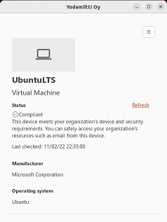
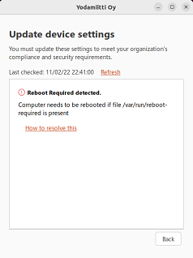
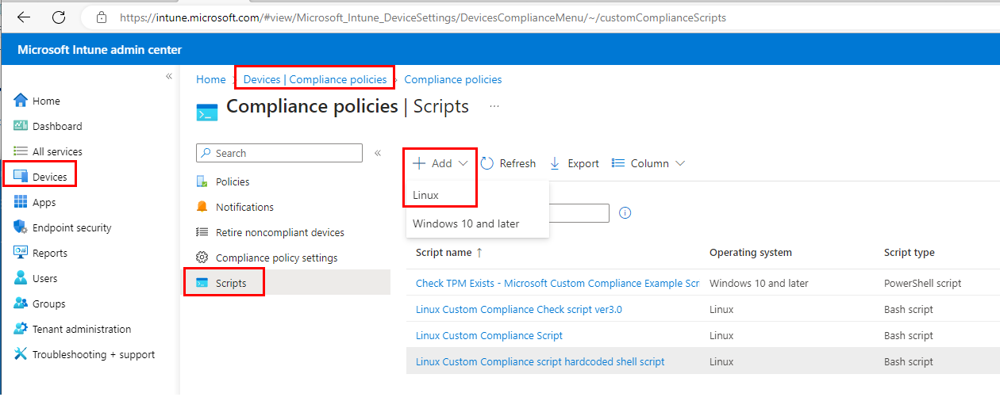
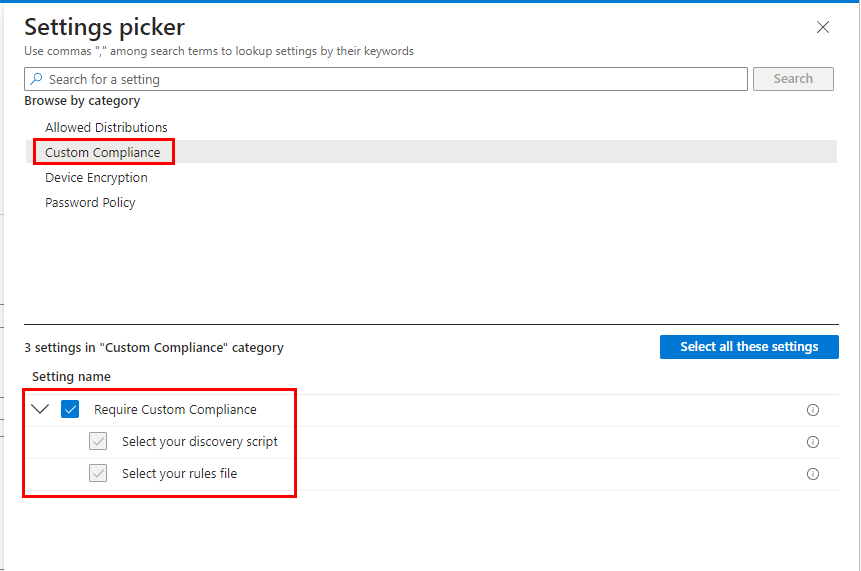
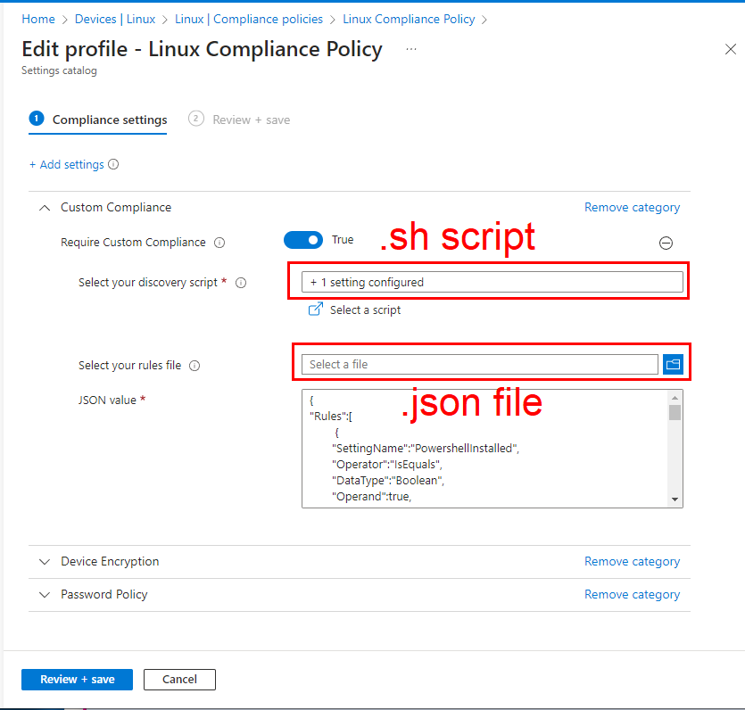

# Intune Linux Custom Compliance script 3.0
Example scripts how to run Linux Custom Compliance checks with Intune.
This script is Bash script which includes Powershell script inside.




## Quick links to files:
* [Intune_Linux_Custom_Compliance_script.sh](https://github.com/petripaavola/Intune/blob/master/Linux/Intune_Linux_Custom_Compliance_script.sh)
* [Intune_Linux_Custom_Compliance_script_Rules_file.json](https://github.com/petripaavola/Intune/blob/master/Linux/Intune_Linux_Custom_Compliance_script_Rules_file.json)

## Custom Compliance checks
Custom Compliance checks are configured in **.json**-file ([Intune_Linux_Custom_Compliance_script_Rules_file.json](https://github.com/petripaavola/Intune/blob/master/Linux/Intune_Linux_Custom_Compliance_script_Rules_file.json))

You can configure, enable and disable custom compliance check settings in json file without even touching to .sh script. For correct json and rule operator syntax it is best to copy existing rule and edit values on that.

You can validate json syntax with command (red means json is not valid)
```
Get-Content -Path .\Intune_Linux_Custom_Compliance_script_Rules_file.json | ConvertFrom-Json
```
## Custom Compliance checks in this version:
* **Powershell is installed**
* **Powershell version**
  * 7.3.3 minimum currently configured in json
* **Reboot Required check**
  * file should not exist /var/run/reboot-required)
* **MS Edge**
  * Check MS Edge is installed
    * file should exist /opt/microsoft/msedge/msedge
  *	Check MS Edge version
* **Kernel version**
  *	Check Kernel version
    * 5.19.35-generic minimum currently configured in json
  *	Check Kernel patch level
  *	Check Kernel flavour
  *	Check Kernel tainted state
* **SecureBoot status**
  * require SecureBoot configured in json
* **sysctrl values** (placeholder to check any value)
  *	user.max_user_namespaces
* **gsettings values**  (placeholder to check any value)
  *	org.gnome.desktop.screensaver lock-enabled
  * org.gnome.desktop.screensaver idle-activation-enabled
  * org.gnome.desktop.session idle-delay
    * 10 minutes currently configured in json
* **Defender for Endpoint on Linux status**
  * MicrosoftDefenderForEndpointOnLinux_Installed
  * MicrosoftDefenderForEndpointOnLinux_RegisteredToOrganization
  * MicrosoftDefenderForEndpointOnLinux_Healthy
  * MicrosoftDefenderForEndpointOnLinux_DefinitionsStatus_up_to_date
  * MicrosoftDefenderForEndpointOnLinux_real_time_protection_enabled
## How script works
Linux Compliance script itself is Bash script because POSIX-compliant shell script is requirement for Intune. However script includes Powershell script and compliance checks are done in Powershell part.

So Bash script is just launcher for Powershell script

Script creates 2 **log files** for debugging and testing
* **/tmp/IntuneCustomComplianceScript_Bash.log**
* **/tmp/IntuneCustomComplianceScript_Powershell.log**

You can also check syslog when Refreshing settings
```
tail -f /var/log/syslog
```

Linux custom compliance script runs in user context who enrolled Ubuntu device to Intune. You can verify this from log files.

When you upload scripts to Intune they are usually immediately used in client on next Refresh so you can edit code and test really quickly. You can verify this from log files -> change script version number for example.

Be sure NOT to write anything to STDOUT because that will break the compliance check. Only Powershell part of script is allowed to return compressed JSON to STDOUT which is then passed to Intune for custom Compliance Check.

## Requirements
* **Powershell must be installed for this script to work**
  * Script will check existence of Powershell (/opt/microsoft/powershell/7/pwsh)
  * Check these [Microsoft instructions](https://learn.microsoft.com/en-us/powershell/scripting/install/install-ubuntu?view=powershell-7.2) how to install Powershell to Ubuntu
* You can create Dynamic Azure AD Group for targeting the Linux Compliance Policy using this rule
  * **(device.deviceOSType -eq "Linux")**

## Limits
* Check current limits from [Microsoft documentation](https://learn.microsoft.com/en-us/mem/intune/protect/compliance-custom-script#limits)
* Scripts can be no larger than 1 megabyte (MB) each.
* Output generated by each script can be no larger than 1 MB.
* Scripts must have a limited run time:
  * **On Linux, scripts must take five minutes or less to run.**
    * Note! You can find script total runtime from end of log file /tmp/IntuneCustomComplianceScript_Powershell.log
  * On Windows, scripts must take 10 minutes or less to run.
* Own personal note: script runs in user context who enrolled device to Intune. This might limit being creative and thinking outside the box :)

## Add script to Microsoft Intune
In [Microsoft Intune](https://intune.microsoft.com) add Linux Custom Compliance script  
**Devices -> Compliance policies -> Script -> Add**  


Then create Linux Compliance Policy and select Custom Compliance from Settings picker  
**Devices -> Linux -> Compliance policies -> Create policy**  
  



## Screenshots


**Intune Linux Compliance Policy**


