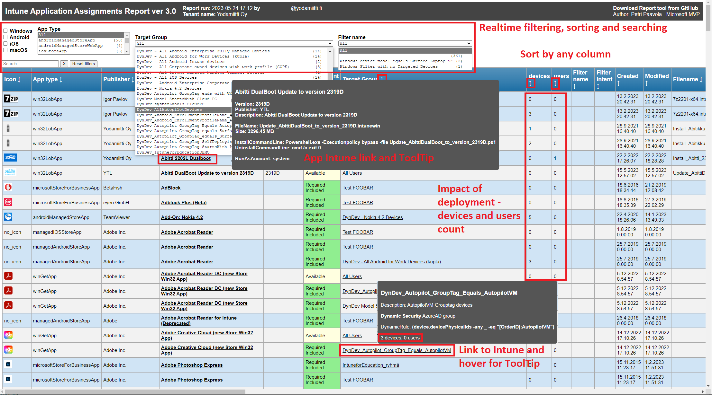
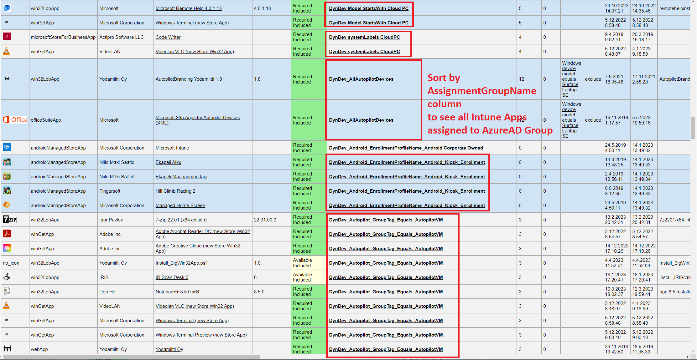

# Intune HTML reports - Check updated Intune App Assignment Report
Reports which we don't have in Intune (at least at this time)

**Quick links to reports**
* **[Intune Application Assignment Report - New version updated](#IntuneAppAssignmentsReport)**
  * **Huge update to ver3.0. Check it out! (24.5.2023)**
* **[Intune Configurations Assignment Report](#IntuneConfigurationAssignmentsReport)**
  * Updated version to 3.0 work in progress


<a id="IntuneAppAssignmentsReport"></a>
## Create-IntuneAppAssignmentsReport.ps1 ver3.0 - Updated 24.5.2023 ###
**Huge update to current 3.0 version! Last Intune Application Assignment Report you need :)**

This PowerShell script creates an HTML report from all Intune App Assignments. This report shows information not easily available in the Intune UI.

  

Link to script [Create-IntuneAppAssignmentsReport.ps1](https://github.com/petripaavola/Intune/blob/master/Reports/Create-IntuneAppAssignmentsReport.ps1)

**Quick start**  
```
# Download from PowershellGallery
Save-Script Create-IntuneAppAssignmentsReport -Path ./

# Run script (create report)
./Create-IntuneAppAssignmentsReport.ps1
```

### Features ###

* This report shows information which is not available in Intune UI without making tens or hundreds of clicks to all Apps and AzureAD Groups
* 2 main views usually used:
  * Find AzureAD Groups where single Application is assigned to
    * Sort by **App name** column (default)
  * **Find all Apps that are assigned to single AzureAD Group**
    * **this view does not exist in Intune**
    * Sort by **Target Group** column
* See **impact** of Assignment
  * Get number of devices and users in Assignment group
* Realtime **filtering and free text search**
  * Filter by OS, App Type, Assignment Target Group, Intune Filter Name
  * Free text search
* **Sort** by any column
* **Hover** on ApplicationName, TargetGroup and/or FilterName to get more information
* **Web link** to Intune Application, Target AzureAD Group and Intune Filter
* **Export** CSV file, json file and paste to Excel

### Report overview ###


### What Apps are assigned to AzureAD Group ###
**Intune does not have this kind of view.**


### Usage ###

Make sure you have **Intune Powershell module** installed and updated  
You can install Intune Powershell management module to your user account with command
```
Install-Module -Name Microsoft.Graph.Intune -Scope CurrentUser
```
**Download** script from [PowershellGallery](https://www.powershellgallery.com/packages/Create-IntuneAppAssignmentsReport) with command:  
```
Save-Script Create-IntuneAppAssignmentsReport -Path ./
```
**Run script**  
```
./Create-IntuneAppAssignmentsReport.ps1
```
### Parameters ###

The script accepts the following parameters:

| Parameter                        | Description                                                                                                                                                                                                                               |
|----------------------------------|-------------------------------------------------------------------------------------------------------------------------------------------------------------------------------------------------------------------------------------------|
| `-ExportCSV`                     | Export report as a CSV file.                                                                                                                                                                                                              |
| `-ExportJSON`                    | Export report as a JSON file.                                                                                                                                                                                                             |
| `-ExportToExcelCopyPaste`        | Export report to Clipboard for easy pasting into Excel.                                                                                                                                                                                   |
| `-UseOfflineCache`               | Create report using files from the cache folder.                                                                                                                                                                                          |
| `-DoNotOpenReportAutomatically`  | Prevent automatic opening of the HTML report in a web browser. Useful for automating report creation.                                                                                                                                    |
| `-UpdateIconsCache`              | Update the App icon cache. New Apps will always get icons downloaded automatically but existing icons are not automatically updated.                                                                                                     |
| `-IncludeAppsWithoutAssignments` | Include Intune Applications without Assignments. This will display a lot of Apps you didn't even know exist inside Intune/Graph API.                                                                                                      |
| `-DoNotDownloadAppIcons`         | Prevent downloading of application icons.                                                                                                                                                                                                 |
| `-IncludeIdsInReport`            | Include application IDs in the report. This makes the report wider so it is disabled by default.                                                                                                                                         |
| `-IncludeBase64ImagesInReport`   | Includes Application icons inside the HTML file. Note! This is slow and creates a large HTML file.                                                                                                                                        |
### Examples ###
```
.\Create-IntuneAppAssignmentsReport.ps1
.\Create-IntuneAppAssignmentsReport.ps1 -UseOfflineCache
.\Create-IntuneAppAssignmentsReport.ps1 -ExportCSV -ExportJSON
.\Create-IntuneAppAssignmentsReport.ps1 -ExportToExcelCopyPaste
.\Create-IntuneAppAssignmentsReport.ps1 -UpdateIconsCache
.\Create-IntuneAppAssignmentsReport.ps1 -DoNotDownloadAppIcons
.\Create-IntuneAppAssignmentsReport.ps1 -DoNotOpenReportAutomatically
.\Create-IntuneAppAssignmentsReport.ps1 -IncludeAppsWithoutAssignments
```

---
<a id="IntuneConfigurationAssignmentsReport"></a>
## Create_IntuneConfigurationAssignments_HTML_Report.ps1
[Create_IntuneConfigurationAssignments_HTML_Report.ps1](https://github.com/petripaavola/Intune/blob/master/Reports/Create_IntuneConfigurationAssignments_HTML_Report.ps1)

**Work is in progress to update this to 3.0 version which has same features than the Application report has**

2 views:
* Find where single Configuration Profile is assigned to
* Find all Configuration Profiles that are assigned to single AzureAD Group (this view does not exist in Intune)

Platform based tables and quick links

### Overview


### Where Configuration Profile is assigned to


### What Configuration Profiles are assigned to AzureAD Group

